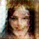

# GANs and Autoencoders Project - Signature and Image Generation
This repository contains implementations of Variational Autoencoders (VAE), Generative Adversarial Networks (GAN), and their variations, applied to signature generation and CIFAR-10 image generation. The project covers the following tasks:
## 1. Custom GAN Implementation for CIFAR-10
- Objective: Implement a custom GAN for generating CIFAR-10 images. The discriminator is designed to evaluate the similarity between a generated image and a real image.
- Dataset: CIFAR-10 (limited to 'cats' and 'dogs' classes).
- Steps:
  - Use a custom neural network as the discriminator to compare a pair of images (generated and real) and output a similarity score.
  - The generator tries to minimize this score, aiming to produce images that are as close as possible to the real ones.
  - Architecture: A custom discriminator architecture, potentially based on the Siamese Network concept.
  - Generated Image from GAN
  - 
## 2. Conditional GAN Implementation for Person Face Sketches
- Objective: Implement a Conditional GAN (cGAN) for generating realistic face images from sketches.
- Dataset: Person Face Sketches dataset.
- Steps:
  - Train the cGAN to map sketches to realistic face images.
  - Focus on generating accurate and visually realistic face images conditioned on the input sketch.
  - Evaluation: The model should generate high-quality face images based on given sketches.
  - Generated Image from CGAN
  - 
## 3. CycleGAN Implementation for Person Face Sketches
- Objective: Implement a CycleGAN to convert between face images and sketches in both directions.- 
- Dataset: Person Face Sketches dataset.
- Steps:
  - Train the CycleGAN to translate face images to sketches and vice versa (image-to-image translation).
  - Save model weights periodically and handle memory issues by splitting the dataset into smaller batches if necessary.
  - Evaluation: The model should successfully generate a face image from a sketch and a sketch from a face image.
  - CycleGAN Fake Image:
  - 
  - CycleGAN Fake Sketch:
  - 
## User Interface
- Objective: Deploy the trained models with a simple web-based user interface (UI).
- Framework: Flask or any other API framework.
- Features:
  - Users can upload an image (or use live camera input).
  - The model will either convert the image into a sketch or generate a real face from a sketch, depending on the input.
## Datasets
- [Person Face Sketches Dataset: Used for Conditional GAN and CycleGAN tasks](https://www.cs.toronto.edu/~kriz/cifar.html)
- [CIFAR-10 Dataset](https://www.cs.toronto.edu/~kriz/cifar.html)

